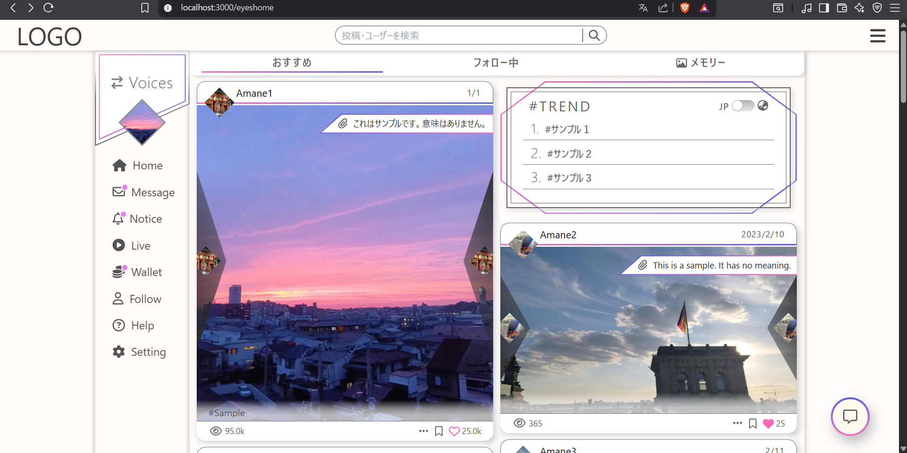
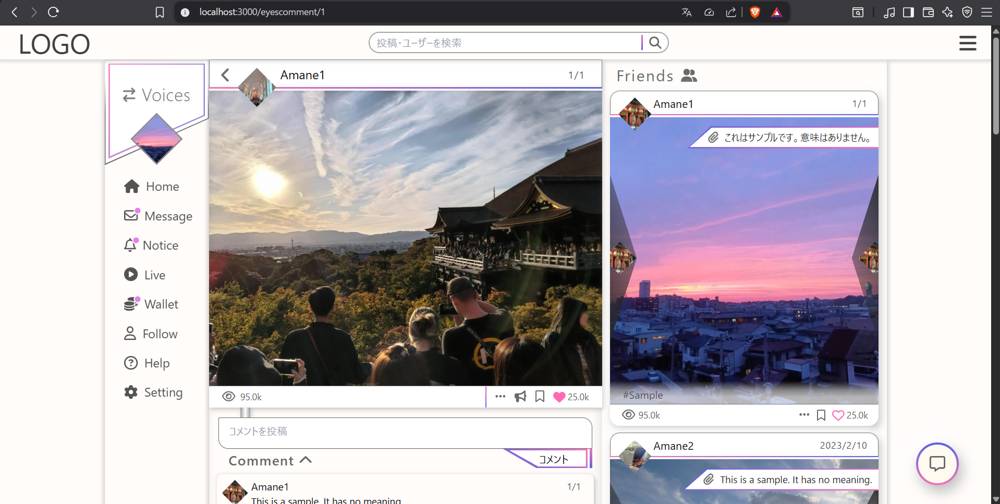
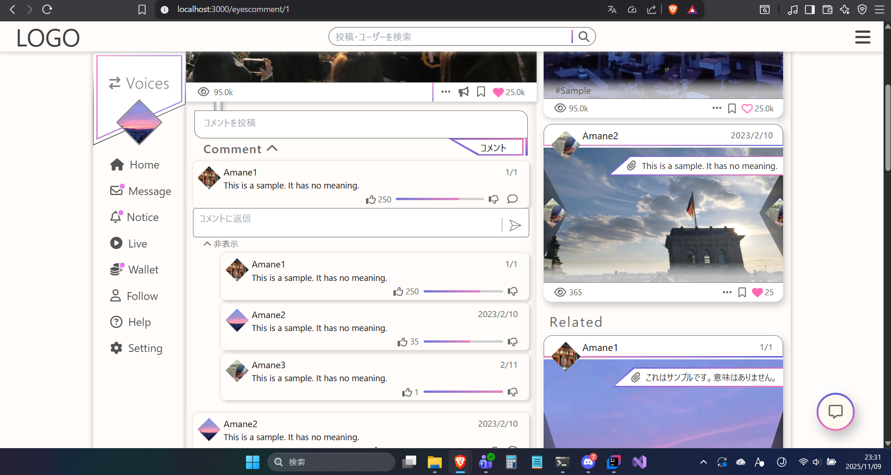
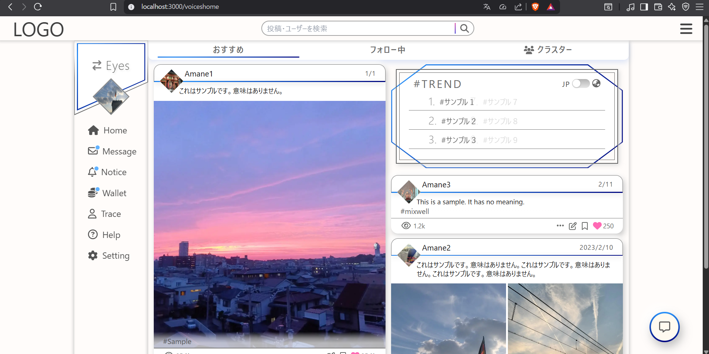
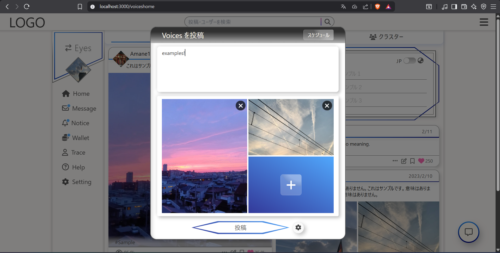
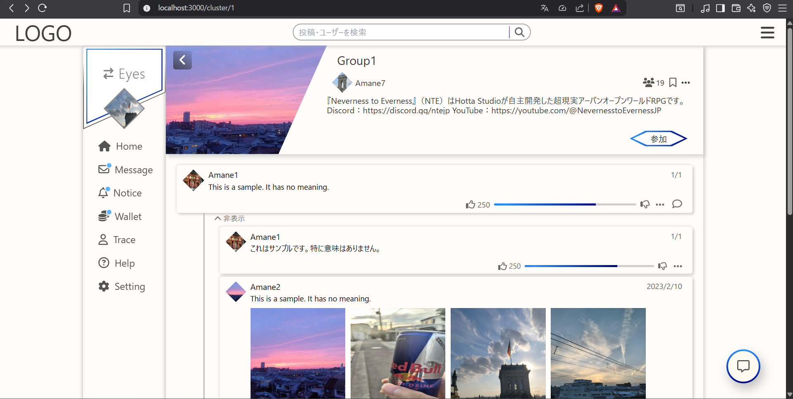
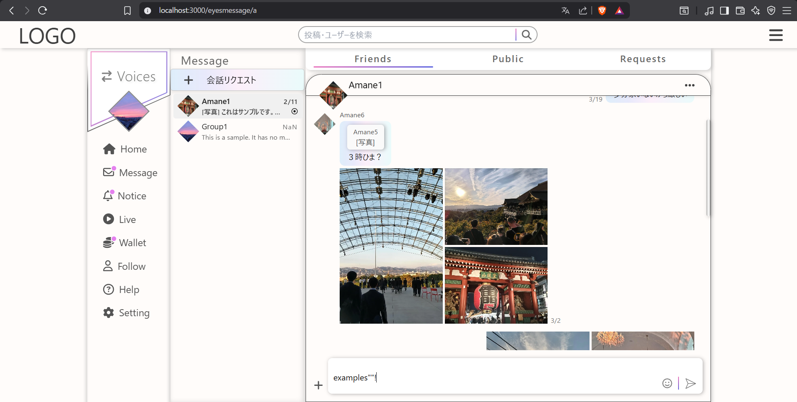
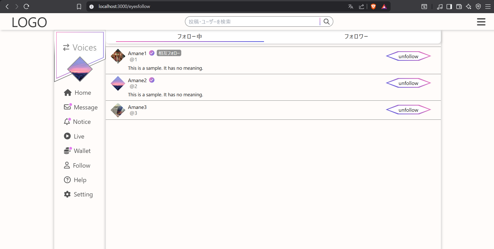
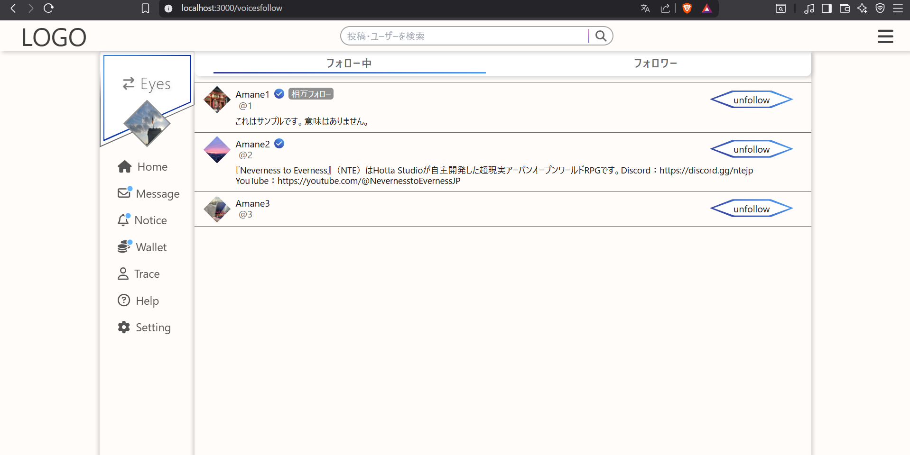
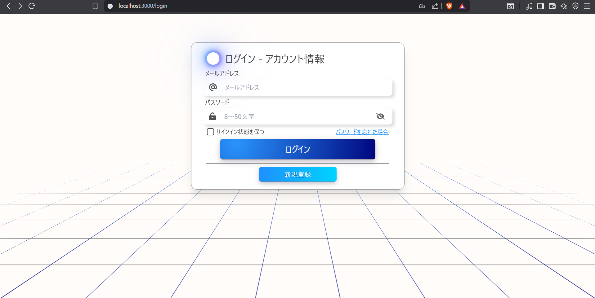

# SNS型Webアプリ（Next.js × Spring Boot）
> 開発途上のためセットアップいただいても動作いたしません。あらかじめご了承ください。

## 概要
　新規SNSアプリの多くが用途別に分化して利用が分散し、ユーザーの負担にも繋がっている課題を念頭に、多種の需要を一元的に包摂出来るSNSの開発を目指した。 
　従来のSNSの「完成」を掲げ、機能の充実に加えて着目したのはSNSの役割の二面性である。ユーザーのSNSの利用姿勢は、投稿を共有したい対象が現実世界ベースか不特定多数かで大別される。見せたい自分を誇示する場として利用するか、現実から離れた場として利用するかと言い換えてもよいだろう。既存のアプリ自体は基本的にそのいずれかを主眼として機能が設計されており、これが第一の分化の原因だと考えた。 
　そこで、本アプリは一部の機能で緩やかに連結されながらも明確に分離された二種のプラットフォームを内蔵する（下図）。これに対応して、ユーザーには一つのアカウントの中に二つの独立した名義("Persona")が設定され、双方を切り替えて各プラットフォームの機能を利用することができる。匿名性に関しても利用する機能によって多様な幅を持つ。 
　これにより単なる機能面を超えた巨視的なレベルでの「完成」が達成出来ると考える。

## スクリーンショット（一部）
<table>
  <tr>
    <td></td>
    <td></td>
  </tr>
  <tr>
    <td></td>
    <td></td>
  </tr>
  <tr>
    <td></td>
    <td></td>
  </tr>
  <tr>
    <td></td>
    <td></td>
  </tr>
  <tr>
    <td></td>
    <td></td>
  </tr>
  <tr>
    <td></td>
    <td></td>
  </tr>
</table>

## 主な機能
- 名義(Persona)切替
- 各種メディア投稿・コメント・掲示板系
- メッセージ機能
- フォロー系
- 検索系
- アカウント管理系　etc.

## プロジェクト構成の概要
    .
    ├─ frontend/                 #フロントエンド(Next.js)
    │  ├─ src/
    │  │ ├─ components/        # UIコンポーネント
    │  │ ├─ pages/             # ページ（ルーティングのみ）
    │  │ ├─ styles/            # CSS
    │  │ ├─ types/             # 型定義
    │  │ └─ utils/             # hooks・validator・Zodスキーマ等
    │  ├─ public/
    │  ├─ package.json
    │  ├─ next.config.ts
    │  └─ ...
    ├─ backend/                  #バックエンド(Spring Boot)
    │  ├─ modules/
    │  │ ├─ api/               # 起動モジュール 
    │  │ ├─ common/            # 例外・共通型
    │  │ ├─ feature-auth/      # 認証周辺
    │  │ ├─ feature-user/      # User/Persona
    │  │ ├─ feature-post/      # EyesPost/VoicesPost
    │  │ └─ db-migration/      # Flyway 
    │  ├─ settings.gradle.kts
    │  ├─ build.gradle.kts
    │  └─ ...
    ├─ docker-compose.yml
    └─ README.md

## セットアップ
**前提**：パッケージマネージャーは **npm** を使用。

### Frontend
    cd frontend
    npm install
    npm run dev
    # → http://localhost:3000

### Backend
    cd backend
    ./gradlew assemble
    ./gradlew :modules:api:bootRun --args="--spring.profiles.active=local"
    # → http://localhost:8080

## 技術スタック
- Frontend: Next.js 15.0.3 / React 18.3.1 / TypeScript 5.7.2
- Backend API: Spring Boot 3.5.7 / Java 21.0.9

## 動作環境
- Node.js: v22.11.0
- npm: 10.9.0（`package-lock.json` 同梱）
- OS: Windows 10・11（開発時の環境）
- ブラウザ: 最新版のGoogle Chrome（開発時の環境）